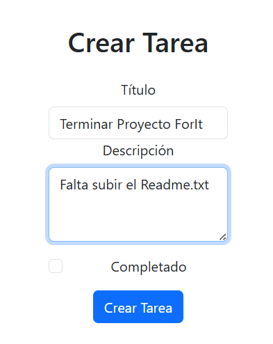
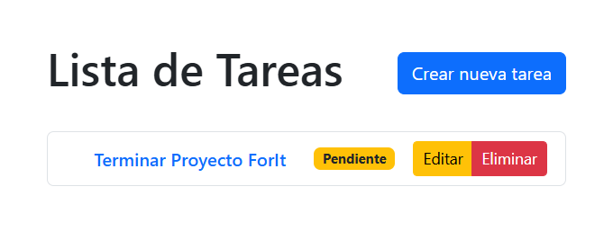
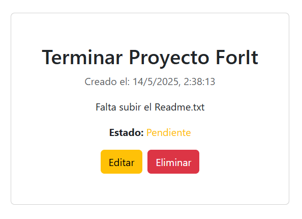
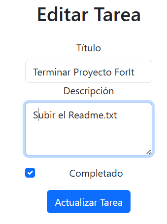
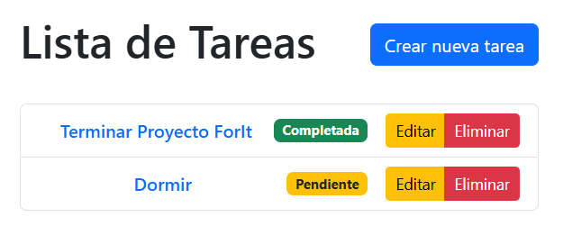
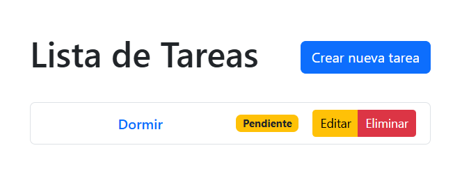

# Gestor de Tareas (Task Manager)

Una aplicación web full-stack simple para crear, editar, listar y eliminar tareas.  
Desarrollada con **React** en el frontend y **Node.js/Express** en el backend.

---

## Características

- Crear nuevas tareas con título y descripción
- Editar tareas existentes
- Marcar tareas como completadas o pendientes
- Eliminar tareas

---

## Tecnologías utilizadas

- **Frontend:** React + React Router + Bootstrap
- **Backend:** Node.js + Express
- **Comunicación:** API REST (JSON)
- **Persistencia:** Almacenamiento en memoria

---

## Instalación y ejecución

### 1. Clonar el repositorio

```bash
git clone https://github.com/YOMYMOY/taskList.git
cd taskList
```

### 2. Instalar dependencias
Una vez dentro de la carpeta taskList, entramos a la de backend y luego a la de frontend.

```bash
cd backend
npm install
```
```bash
cd ../frontend
npm install
```

### 3. Crear archivo `.env` en el frontend
En la carpeta `frontend`, crear un archivo `.env` con el siguiente contenido:
```env
VITE_API_URL=http://localhost:3000
```

### 4. Ejecutar ambos servidores
Si ya estamos dentro de la carpeta `frontend` en la terminal, solo colocamos
```bash
npm run dev
```
Luego en una nueva terminal dentro de la carpeta `backend` tipeamos
```bash
npm start
```
Comúnmente el fontend va a iniciar en el puerto 5173, así que por último

### 4. Abrir en navegador
Abrí http://localhost:5173 en tu navegador para usar la app.

---

## Algunas imágenes de la app funcionando

### Agregar una tarea



### Lista de tareas



### Detalle de una tarea



### Editar una tarea



### Lista editada



### Tarea eliminada


